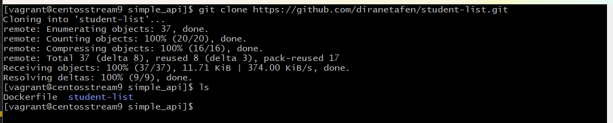

# student-list project

  

Please find the specifications by clicking <a href="https://github.com/diranetafen/student-list.git">here</a>

------------

Firstname : Carlin

Surname : FONGANG

Email : fongangcarlin@gmail.com

For Eazytraining's 17th DevOps Bootcamp

Period : January at March 2024

Sunday the 14th, march 2023

 
LinkedIn : https://www.linkedin.com/in/carlinfongang/

## Application

## The need

## My plan

### The files' role

## Build and test
1. Clone du repo du projet 

2. Préparation du Dockerfile

3. Build de l'image api

4. Tag de l'image

5. Run d'un conteneur avec la nouvelle image pour test
 docker run --name test -d -p 8000:5000 -v ./student_age.json:/data/student_age.json webapi:v1.3 /bin/bash

6. Test
curl -u toto:python -X GET http://localhost:8000/pozos/api/v1.0/get_student_ages

## Deployment

## This concludes my Docker mini-project run report.