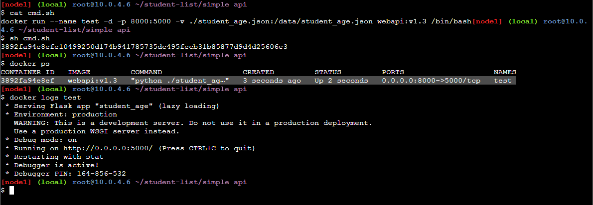
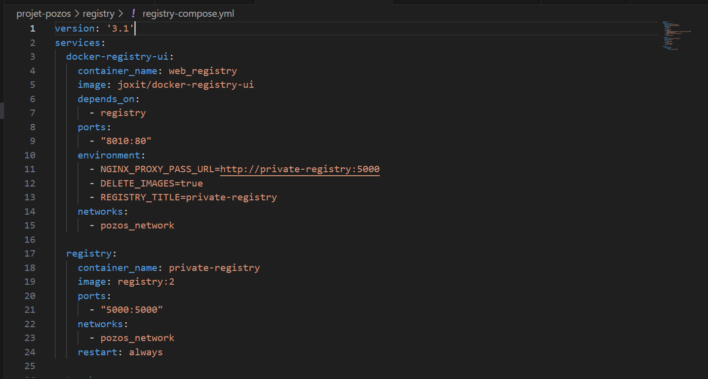

# student-list project
<p align="center">
  <a href="https://github.com/diranetafen/student-list.git">
    
  </a>
</p>
<p align="center">Please find the specifications by clicking <a href="https://github.com/diranetafen/student-list.git">here</a></p>


------------

Firstname : Carlin

Surname : FONGANG

Email : fongangcarlin@gmail.com

For Eazytraining's 17th DevOps Bootcamp

Period : January at March 2024

Sunday the 14th, march 2023


 
LinkedIn : https://www.linkedin.com/in/carlinfongang/


## Application description
In this project, I deployed the "student_list" application, whose role is to display the list of students. It's a fairly basic application to be deployed on behalf of the POZOS company.

The application is divided into microservices: 
Module 1 : is a REST API including very basic authentication, the API transmits the desired student list in JSON format.
Module 2 : is a php and html web application enabling the user to interpret the results of requests transmitted to the API and display them on the browser.

## Infrastructure
For this project, I used : 
1. A main machine based on CentOS 7.6 on which I installed docker and git

2. I built the API application instance and dispatched both api and web services on the same instance

3. I used CentOS7.6 as this is the operating system used by the POZOS company for its servers

4. Security is a sensitive issue for the IT department, so it's important not to disable any security firewall or other security mechanism without explanation.

## My target
The objectives of my mission : 

1. Build an image of the API serives to be used when setting up the api storyteller.

2. Deliver a docker container for each module 

3. Allow api calls from the web container

4. Set up a private registry to store POZOS company docker images.


## My plan
To get started with this docker container-based deployment stack : 
1. I set up a working environment based on CentOS7.6 
2. I install the required docker and git dependencies 
3. First, I'll make a clone of the project repository to be docked. 
4. Once placed in the simple_api/ directory, I configure the Dockerfile for building the API image.
5. I then test the new image by running it via a docker run, making sure to mount the directories mentioned in the project instructions.
6. I then carry out the functional test and validate that the image is working correctly.
7. I then create the studentlist_compose.yml file, which will be used to dispatch the web and api containers carrying the application's web interface and api respectively. 
7. I'll do a test on the web interface to make sure that the api returns responses to the queries requested.
8. Once the previous step has been validated, I'll set up a second docker-compose file to deploy a private registry for backing up POZOS microservices images.

### Ressources
the list of files that will be generated/used in this project: 
 - Dockerfile, student_age.py, studen_age.json, studenlist_compose.yml, registry_compose.yml

 Images to be created/used
 - webapi:v1.3 , php:apache, joxit/docker-registry-ui, registry:2


## Build and test
1. Project repo clone
````
git clone https://github.com/diranetafen/student-list.git
ls
````
> 


2. Préparation du Dockerfile
````
cd student-list/simple_api/
ls
nano Dockerfile #edition du Dockerfile
````
>

3. Build de l'image api depuis le WDir student-list/simple_api/
````
docker build -t webapi:v1.3 .
docker images
````
>


4. Run d'un conteneur avec la nouvelle image pour test : 
 ````
 docker run -it --name test -d -p 8000:5000 -v ./student_age.json:/data/student_age.json webapi:v1.3
 docker ps
 ````
>

5. Test du conteneur API : 
````
curl -u toto:python -X GET http://localhost:8000/pozos/api/v1.0/get_student_ages
````
>

### outside the project context
6. image tag to prepare push to public registry
`docker tag 306aaa1bfb1f carlfg/webapi:v1.3`
>

7. Push image to public registry (dockerhub)
````
docker login
docker push carlfg/webapi:v1.3
````
>


## Deployment
1. Redaction of the docker-compose file from the user directory
````
cd /home/$USR
nano studentlist_compose.yml
````

````


2. Launching docker compose :
````
docker compose up -f studentlist-compose.yml up -d
docker ps
````
>
>

3. Test launch and front-end answer :
`curl localhost:8008`
>

4. Check web interface
>

## Private Registry
1. Setup of registry-compose to deploy the services

2. Lauch of docker compose 

>


3. Functional register web interface
>

4. Tag and push of previously created image
>

5. Check local registry via web interface
>

## This concludes my Docker mini-project run report.
During this project, I had to build the image integrating the POZOS company's API service to facilitate its deployment in a test or production environment, I configured the Application we / API server networks as well as the private registry container networks, I created and mounted persistent volumes and deployed microservices using docker-compose. 

This project was an enriching experience that enabled me to strengthen my technical skills and gain a better understanding of the principles of mciroservices.